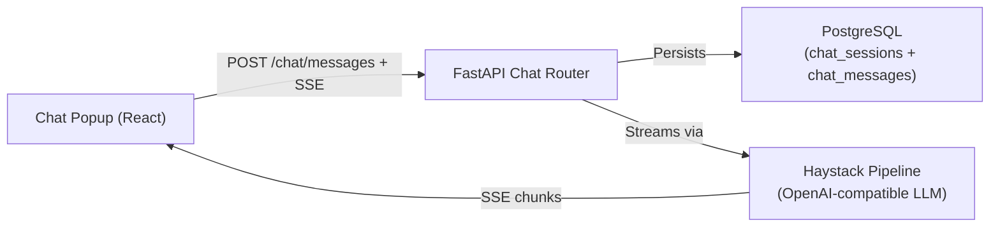
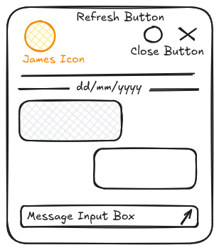
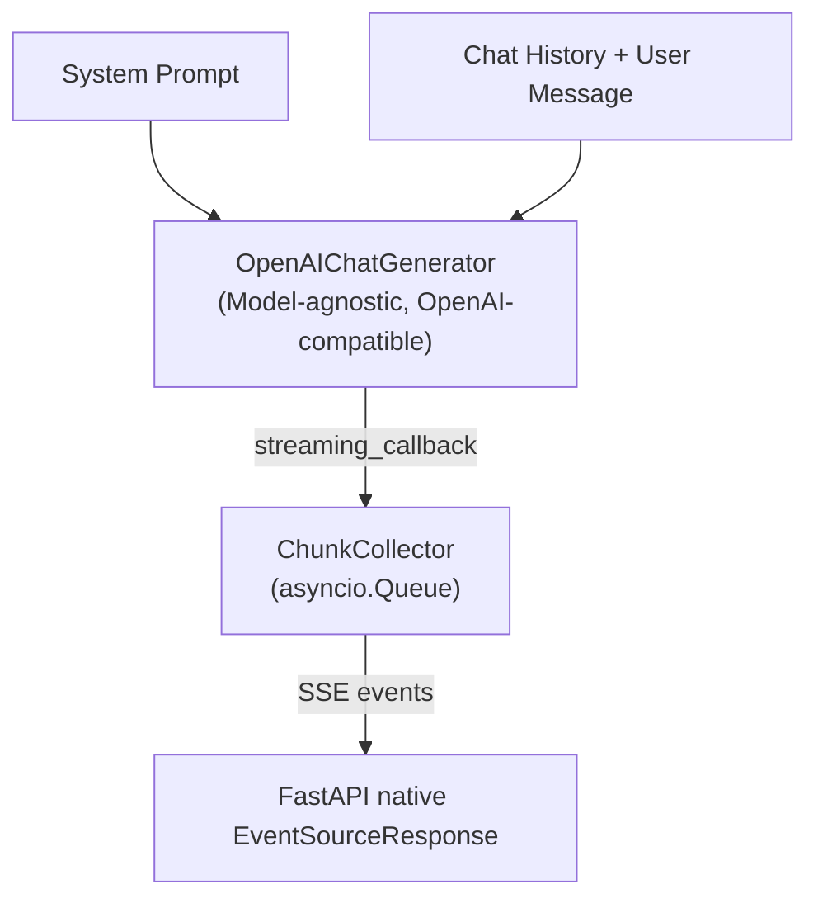
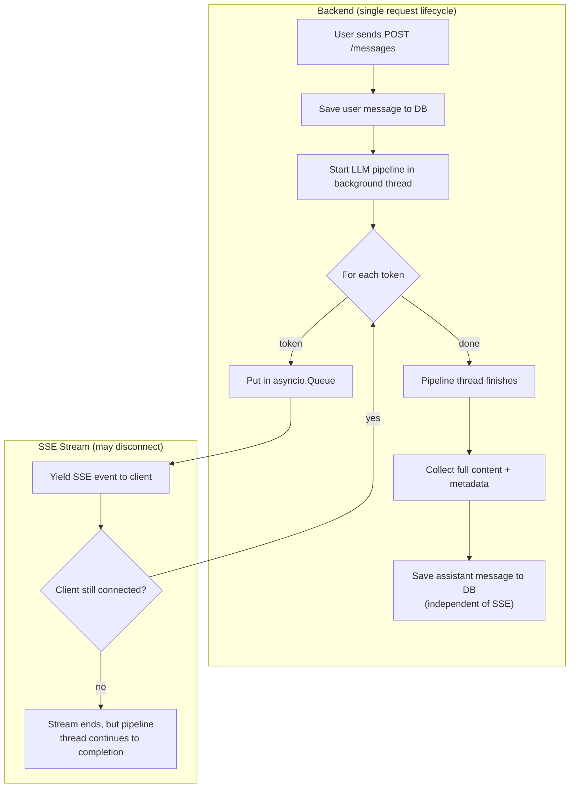

# 001 — Chat Basics

> Basic AI chat assistant with streaming responses, conversation persistence, and markdown support.

## Meta

| Field           | Value                          |
|-----------------|--------------------------------|
| **Status**      | Review                         |
| **Author**      | Agent + Ricardo                |
| **Created**     | 2026-06-01                     |
| **Updated**     | 2026-06-01                     |
| **Depends on**  | —                              |
| **Supersedes**  | —                              |

---

## Problem Statement

Ownit is a Self-Regulated Learning platform, but it currently has no AI-powered assistance.
Students need a way to interact with an AI assistant that can answer questions, provide study
guidance, and eventually offer personalized feedback. This spec introduces the foundational
chat feature: a popup chat window where the student converses with an LLM, with messages
streamed in real-time via SSE and persisted in the database for future reference.

---

## Goals & Non-Goals

### Goals
- [ ] Chat popup UI integrated into the app shell (accessible from any page).
- [ ] Real-time streaming of AI responses via Server-Sent Events (SSE).
- [ ] Conversation persistence: sessions and messages stored in PostgreSQL.
- [ ] Markdown rendering in chat messages (both user and AI).
- [ ] LLM integration using Haystack with a model-agnostic, OpenAI-compatible generator.
- [ ] LLM metadata stored as a single JSONB column (model, tokens, response time, etc.).
- [ ] Multi-turn conversation support with chat history sent to the LLM.

### Non-Goals
- RAG (Retrieval-Augmented Generation) or context from study data — future spec.
- Voice input/output.
- File/image uploads in chat.
- Multiple simultaneous conversations (one active session at a time).
- Chat history page or session listing — future spec.
- AI proactive suggestions or notifications.

---

## Proposed Solution

### Overview

The feature has three layers:



1. **Frontend**: A floating chat panel (fixed position, bottom-right corner). Contains a message list, markdown-rendered bubbles, and an input box.
2. **Backend**: A FastAPI feature module (`features/chat/`) that manages sessions and messages, invokes a Haystack chat pipeline, and streams the LLM response as native FastAPI SSE.
3. **AI Pipeline**: A Haystack pipeline with `OpenAIChatGenerator` configured via environment variables (model-agnostic, any OpenAI-compatible provider), receiving conversation history and streaming tokens back through a callback bridge.

### User Experience

#### Opening the Chat
1. A floating chat button (FAB) is visible on every authenticated page (bottom-right corner).
2. Clicking it opens a floating chat panel (fixed-position, not a drawer).
3. If no active session exists, one is created automatically on the first message.

#### Sending a Message
1. User types in the input box and presses Enter or clicks the send button.
2. The user message appears immediately in the chat (optimistic UI).
3. An AI response bubble appears with a streaming typing indicator.
4. Tokens stream in via SSE; the bubble updates progressively with markdown rendering.
5. When streaming completes, the full message (user + AI) is persisted.

#### Chat Popup UI (from wireframe)

```
┌──────────────────────────────────┐
│ 🐴 James        🔄  ✕           │  ← Header: horse emoji, name, refresh (new session), close
│──────────────────────────────────│
│            dd/mm/yyyy            │  ← Session date separator
│──────────────────────────────────│
│                                  │
│  ┌────────────────────┐          │
│  │ AI message (md)    │          │  ← Left-aligned AI bubbles
│  └────────────────────┘          │
│                                  │
│          ┌─────────────────┐     │
│          │ User message    │     │  ← Right-aligned user bubbles
│          └─────────────────┘     │
│                                  │
│  ┌────────────────────┐          │
│  │ AI streaming...█   │          │  ← Streaming indicator
│  └────────────────────┘          │
│                                  │
│──────────────────────────────────│
│ Type a message...          ✈️    │  ← Input box + send button
└──────────────────────────────────┘
```



#### Edge Cases & Error States
- **Network error during SSE**: Show an inline error message in the chat with a "Retry" button.
- **LLM timeout/failure**: Display "Sorry, I couldn't generate a response. Please try again." as an error message bubble.
- **Empty message**: Disable the send button when input is empty.
- **Rate limiting**: Not in scope for this spec (future).

### Data Model

#### `chat_sessions` Table

Represents a single conversation thread between a student and the AI.

```python
chat_sessions = Table(
    'chat_sessions',
    metadata,
    Column('id', UUID, primary_key=True, server_default=func.gen_random_uuid()),
    Column('student_id', Integer, ForeignKey('students.id'), nullable=False),
    Column('title', String, nullable=True),  # Auto-generated or null
    *timestamp_columns(),
)
```

#### `chat_messages` Table

Each message in a conversation (both user and AI).

```python
chat_messages = Table(
    'chat_messages',
    metadata,
    Column('id', UUID, primary_key=True, server_default=func.gen_random_uuid()),
    Column('session_id', UUID, ForeignKey('chat_sessions.id', ondelete='CASCADE'), nullable=False),
    Column('role', String, nullable=False),  # 'user' | 'assistant'
    Column('content', String, nullable=False),  # Markdown content
    Column('llm_metadata', JSONB, nullable=True),  # null for user messages
    *timestamp_columns(),
)
```

The `llm_metadata` JSONB column stores all LLM-related information for assistant messages. For user messages, this column is `null`. Example value:

```json
{
  "model": "deepseek-v4-lite",
  "prompt_tokens": 150,
  "completion_tokens": 89,
  "total_tokens": 239,
  "response_time_ms": 1230
}
```

This approach keeps the schema flexible — if the LLM provider returns additional metadata (e.g., `finish_reason`, `system_fingerprint`), it can be stored without a migration.

#### Key Design Decisions
- **UUIDs for chat IDs**: Chat entities use UUID (via `gen_random_uuid()`) instead of serial integers for URL safety and client-side generation potential.
- **Single JSONB metadata column**: All LLM-related metadata (model, tokens, timing) is stored in one `llm_metadata` JSONB column instead of separate columns. This is more flexible and avoids schema migrations when providers return new fields.
- **Cascade delete**: Deleting a session deletes all its messages.
- **`role` as string**: Simple `'user'` / `'assistant'` string. Not using an enum since Haystack `ChatMessage` uses strings and this avoids a migration when adding roles like `'system'` later.

### API Endpoints

| Method | Path | Auth | Description |
|--------|------|------|-------------|
| `POST` | `/chat/sessions` | Yes | Create a new chat session |
| `GET`  | `/chat/sessions/active` | Yes | Get the current active session (most recent) |
| `POST` | `/chat/sessions/{session_id}/messages` | Yes | Send a user message and receive AI response via SSE |
| `GET`  | `/chat/sessions/{session_id}/messages` | Yes | Get all messages in a session |

#### `POST /chat/sessions`

Creates a new chat session for the authenticated student.

**Request Body**: None (empty body).

**Response** (`201 Created`):
```json
{
  "id": "uuid",
  "student_id": 1,
  "title": null,
  "created_at": "2026-06-01T12:00:00Z",
  "updated_at": "2026-06-01T12:00:00Z"
}
```

**Schema**: `ChatSessionResponse`

#### `GET /chat/sessions/active`

Returns the most recently created session for the student, or `404` if none exists.

**Response** (`200 OK`): `ChatSessionResponse`

#### `POST /chat/sessions/{session_id}/messages`

Sends a user message, triggers the LLM pipeline, and streams the AI response via SSE.

**Request Body** (`SendMessageRequest`):
```json
{
  "content": "How do I improve my study habits?"
}
```

**Response**: `text/event-stream` (SSE)

SSE event format:
```
event: token
data: {"content": "Here"}

event: token
data: {"content": " are"}

event: token
data: {"content": " some"}

event: done
data: {"message_id": "uuid", "llm_metadata": {"model": "deepseek-v4-lite", "prompt_tokens": 150, "completion_tokens": 89, "total_tokens": 239, "response_time_ms": 1230}}

event: error
data: {"detail": "LLM pipeline failed"}
```

Event types:
- `token`: A content chunk from the LLM. Client appends to the current message.
- `done`: Signals end of stream. Includes the message ID and full `llm_metadata`.
- `error`: Signals an error occurred during generation.

#### `GET /chat/sessions/{session_id}/messages`

Returns all messages in a session, ordered by `created_at ASC`.

**Response** (`200 OK`):
```json
[
  {
    "id": "uuid",
    "session_id": "uuid",
    "role": "user",
    "content": "How do I improve my study habits?",
    "llm_metadata": null,
    "created_at": "2026-06-01T12:00:00Z",
    "updated_at": "2026-06-01T12:00:00Z"
  },
  {
    "id": "uuid",
    "session_id": "uuid",
    "role": "assistant",
    "content": "Here are some tips...",
    "llm_metadata": {
      "model": "deepseek-v4-lite",
      "prompt_tokens": 150,
      "completion_tokens": 89,
      "total_tokens": 239,
      "response_time_ms": 1230
    },
    "created_at": "2026-06-01T12:00:01Z",
    "updated_at": "2026-06-01T12:00:01Z"
  }
]
```

**Schema**: `list[ChatMessageResponse]`

### Pydantic Schemas

```python
# schemas.py

class SendMessageRequest(BaseModel):
    content: str = Field(..., min_length=1, max_length=4000)

class ChatSessionResponse(BaseModel):
    id: str
    student_id: int
    title: str | None
    created_at: datetime
    updated_at: datetime

class LLMMetadata(BaseModel):
    """Flexible metadata from the LLM provider."""
    model: str
    prompt_tokens: int | None = None
    completion_tokens: int | None = None
    total_tokens: int | None = None
    response_time_ms: int | None = None

    class Config:
        extra = 'allow'  # Accept additional provider-specific fields

class ChatMessageResponse(BaseModel):
    id: str
    session_id: str
    role: str
    content: str
    llm_metadata: LLMMetadata | None
    created_at: datetime
    updated_at: datetime
```

### Haystack Pipeline

#### Architecture



#### Pipeline Setup

A dedicated module `api/src/features/chat/pipeline.py` encapsulates the Haystack pipeline.
The generator is **model-agnostic**: model name, API key, and base URL are all configured
via environment variables, supporting any OpenAI-compatible provider (DeepSeek, OpenAI, Together AI, Ollama, vLLM, etc.).

```python
from haystack.components.generators.chat import OpenAIChatGenerator
from haystack.utils import Secret
from src.core.config import get_settings

SYSTEM_PROMPT = """You are James 🐴, a friendly and knowledgeable AI study assistant 
for the Ownit learning platform. You help students improve their learning habits, 
plan study sessions, and achieve their academic goals. 

Guidelines:
- Be encouraging and supportive.
- Provide actionable, specific advice.
- Use markdown formatting for clarity (lists, bold, headers).
- Keep responses concise but thorough.
- If you don't know something, say so honestly.
"""

def create_chat_generator() -> OpenAIChatGenerator:
    settings = get_settings()
    return OpenAIChatGenerator(
        api_key=Secret.from_env_var('LLM_API_KEY'),
        api_base_url=settings.LLM_BASE_URL,
        model=settings.LLM_MODEL,
        generation_kwargs={
            'max_tokens': 2048,
            'temperature': 0.7,
        },
    )
```

#### Streaming Bridge & Persistence Decoupling

The `ChunkCollector` bridges Haystack's synchronous `streaming_callback` to FastAPI's async SSE.

**Critical architecture decision**: The backend must persist the full AI response **independently
of whether the SSE client (frontend) stays connected**. To achieve this:



The key pattern:

1. The **Haystack pipeline runs in a background thread** (`asyncio.to_thread` / `loop.run_in_executor`).
2. Tokens are pushed to an `asyncio.Queue` and simultaneously **accumulated in a buffer** inside the pipeline thread.
3. After the pipeline finishes (all tokens generated), the pipeline thread **saves the full assistant message + metadata to the database** before signaling completion.
4. The SSE generator reads from the queue and yields events to the client. If the client disconnects mid-stream, the SSE generator stops, but the pipeline thread is unaffected — it continues to completion and still persists the message.
5. This means: even if the user closes the browser mid-stream, the full AI response is saved.

```python
class ChunkCollector:
    def __init__(self, loop: asyncio.AbstractEventLoop):
        self.queue: asyncio.Queue = asyncio.Queue()
        self.loop = loop
        self.content_buffer: list[str] = []  # Accumulates full response

    def callback(self, chunk: StreamingChunk) -> None:
        """Called by Haystack on each token — thread-safe."""
        if chunk.content:
            self.content_buffer.append(chunk.content)
            self.loop.call_soon_threadsafe(
                self.queue.put_nowait, chunk
            )

    def finish(self) -> None:
        self.loop.call_soon_threadsafe(
            self.queue.put_nowait, None  # Sentinel
        )

    @property
    def full_content(self) -> str:
        return ''.join(self.content_buffer)

    async def stream(self):
        while True:
            chunk = await self.queue.get()
            if chunk is None:
                break
            yield chunk


async def run_pipeline_and_persist(
    conn, session_id, messages, collector
):
    """Runs the LLM, accumulates the full response, and persists it.
    This runs to completion regardless of SSE client state."""
    start_time = time.monotonic()
    try:
        result = await asyncio.to_thread(
            generator.run, messages=messages
        )
        elapsed_ms = int((time.monotonic() - start_time) * 1000)

        # Extract metadata from Haystack result
        llm_metadata = {
            'model': result['replies'][0].meta.get('model', settings.LLM_MODEL),
            'prompt_tokens': result['replies'][0].meta.get('usage', {}).get('prompt_tokens'),
            'completion_tokens': result['replies'][0].meta.get('usage', {}).get('completion_tokens'),
            'total_tokens': result['replies'][0].meta.get('usage', {}).get('total_tokens'),
            'response_time_ms': elapsed_ms,
        }

        # Persist the assistant message (runs even if client disconnected)
        save_assistant_message(
            conn, session_id,
            content=collector.full_content,
            llm_metadata=llm_metadata,
        )
    except Exception:
        logger.exception('LLM pipeline failed')
    finally:
        collector.finish()
```

#### Configuration

New environment variables required (model-agnostic):

| Variable | Description | Example |
|----------|-------------|---------|
| `LLM_API_KEY` | API key for the OpenAI-compatible LLM provider | `sk-...` |
| `LLM_BASE_URL` | Base URL for the provider's API | `https://api.deepseek.com/v1` |
| `LLM_MODEL` | Model identifier to use | `deepseek-v4-lite` |

These are added to `Settings` in `core/config.py` and `.env.example`. Changing the model
or provider is a pure configuration change — no code modifications needed.

### Frontend Components

| Component | Path | Description |
|-----------|------|-------------|
| `ChatButton` | `features/chat/components/ChatButton.tsx` | Floating action button (FAB) with 🐴 emoji to toggle the chat panel |
| `ChatPanel` | `features/chat/components/ChatPanel.tsx` | Fixed-position floating panel (bottom-right), the main chat container |
| `ChatHeader` | `features/chat/components/ChatHeader.tsx` | Header bar with 🐴 horse emoji, "James" name, refresh & close buttons |
| `MessageList` | `features/chat/components/MessageList.tsx` | Scrollable list of message bubbles |
| `MessageBubble` | `features/chat/components/MessageBubble.tsx` | Individual message bubble with markdown rendering |
| `ChatInput` | `features/chat/components/ChatInput.tsx` | Text input area with send button |

#### Feature Module Files

| File | Path | Description |
|------|------|-------------|
| `models.ts` | `features/chat/models.ts` | `ChatSession`, `ChatMessage`, `TokenEvent`, `DoneEvent` types |
| `dto.ts` | `features/chat/dto.ts` | `ChatSessionDTO`, `ChatMessageDTO` (snake_case API types) |
| `mappers.ts` | `features/chat/mappers.ts` | DTO → domain model mappers |
| `api.ts` | `features/chat/api.ts` | `createSession`, `fetchActiveSession`, `fetchMessages`, `sendMessage` (SSE) |
| `hooks.ts` | `features/chat/hooks.ts` | `useChatSession`, `useSendMessage`, `useChatMessages` |

#### SSE Client

The `sendMessage` function in `api.ts` will use the native `fetch` API with a `ReadableStream` reader to consume SSE events (not `EventSource`, since we need `POST` + `credentials`):

```typescript
export async function sendMessage(
  sessionId: string,
  content: string,
  onToken: (content: string) => void,
  onDone: (metadata: DoneEvent) => void,
  onError: (error: string) => void,
): Promise<void> {
  const url = `${import.meta.env.VITE_API_URL}/chat/sessions/${sessionId}/messages`;
  const response = await fetch(url, {
    method: 'POST',
    headers: { 'Content-Type': 'application/json' },
    credentials: 'include',
    body: JSON.stringify({ content }),
  });

  if (!response.ok) throw new Error(`Failed: ${response.status}`);

  const reader = response.body!.getReader();
  const decoder = new TextDecoder();
  // Parse SSE events from the stream...
}
```

#### Markdown Rendering

Messages will be rendered using **`react-markdown`** with **`remark-gfm`** for GitHub-flavored markdown (tables, strikethrough, task lists, etc.), wrapped in a `MessageBubble` component with appropriate Mantine styling.

### Business Rules

1. A student can have multiple chat sessions but only one is considered "active" (the most recently created).
2. The "refresh" button creates a new session, effectively starting a fresh conversation.
3. Chat history (all messages in the session) is sent to the LLM on each request to maintain conversational context.
4. The maximum conversation context window is limited to the **last 50 messages** to avoid token overflow.
5. User messages have a maximum length of **4000 characters**.
6. Only authenticated students can access chat endpoints.
7. A student can only access their own sessions and messages (enforced via `student_id` filtering).
8. User messages are stored **before** the LLM is invoked. AI messages are stored **after** the LLM pipeline finishes (regardless of SSE client connection state).
9. If the LLM pipeline fails completely (no tokens generated), the assistant message is **not** stored. If it fails mid-way, the partial response **is** stored with an error note in `llm_metadata`.
10. The backend pipeline thread runs to completion independently of the SSE stream — if the client disconnects, the response is still persisted.

---

## Implementation Plan

### Backend

1. **`api/src/features/chat/tables.py`** — Define `chat_sessions` and `chat_messages` tables (with `llm_metadata` JSONB column).
2. **`api/src/features/chat/schemas.py`** — Define `SendMessageRequest`, `ChatSessionResponse`, `LLMMetadata`, `ChatMessageResponse`.
3. **`api/src/features/chat/pipeline.py`** — Haystack pipeline setup: `create_chat_generator()`, `ChunkCollector`, `run_pipeline_and_persist()`, system prompt.
4. **`api/src/features/chat/service.py`** — Business logic: `create_session()`, `get_active_session()`, `get_messages()`, `save_user_message()`, `save_assistant_message()`, `build_chat_history()`.
5. **`api/src/features/chat/routes.py`** — FastAPI router with 4 endpoints. The `POST /messages` endpoint uses native FastAPI `EventSourceResponse` for SSE streaming.
6. **`api/src/main.py`** — Register the chat router: `app.include_router(chat_router)`.
7. **`api/src/core/config.py`** — Add `LLM_API_KEY`, `LLM_BASE_URL`, and `LLM_MODEL` to `Settings`.
8. **`api/pyproject.toml`** — Add dependency: `haystack-ai`.
9. **`.env.example`** — Add `LLM_API_KEY`, `LLM_BASE_URL`, and `LLM_MODEL`.
10. **Alembic migration** — `uv run alembic revision --autogenerate -m "add chat_sessions and chat_messages tables"`.

### Frontend

1. **`ui/src/features/chat/models.ts`** — Define `ChatSession`, `ChatMessage`, `TokenEvent`, `DoneEvent`.
2. **`ui/src/features/chat/dto.ts`** — Define `ChatSessionDTO`, `ChatMessageDTO`.
3. **`ui/src/features/chat/mappers.ts`** — DTO-to-model mappers.
4. **`ui/src/features/chat/api.ts`** — API functions: `createSession`, `fetchActiveSession`, `fetchMessages`, `sendMessage` (SSE stream reader).
5. **`ui/src/features/chat/hooks.ts`** — React hooks: `useChatSession`, `useSendMessage`, `useChatMessages`.
6. **`ui/src/features/chat/components/ChatButton.tsx`** — Floating action button (🐴 horse emoji).
7. **`ui/src/features/chat/components/ChatPanel.tsx`** — Fixed-position floating panel container (bottom-right).
8. **`ui/src/features/chat/components/ChatHeader.tsx`** — Header with avatar, name, refresh/close buttons.
9. **`ui/src/features/chat/components/MessageList.tsx`** — Scrollable message list with auto-scroll.
10. **`ui/src/features/chat/components/MessageBubble.tsx`** — Message bubble with markdown rendering.
11. **`ui/src/features/chat/components/ChatInput.tsx`** — Text input with send button.
12. **`ui/package.json`** — Add dependency: `react-markdown`, `remark-gfm`.
13. **App shell integration** — Add `ChatButton` to the root layout so it appears on all authenticated pages.

### Migrations

1. Create migration: `cd api && uv run alembic revision --autogenerate -m "add chat_sessions and chat_messages tables"`
2. Apply: `cd api && uv run alembic upgrade head`

---

## Testing Strategy

### Backend Tests

#### Unit Tests (service layer)
- `test_create_session`: Creates a session and verifies it belongs to the correct student.
- `test_get_active_session`: Returns the most recent session, or None.
- `test_save_user_message`: Saves a user message with correct role and content.
- `test_save_assistant_message`: Saves an assistant message with `llm_metadata` JSONB (tokens, model, time).
- `test_build_chat_history`: Returns messages in chronological order, limited to 50.
- `test_session_ownership`: A student cannot access another student's session.

#### Integration Tests (API endpoints)
- `test_create_session_endpoint`: `POST /chat/sessions` returns 201 with session data.
- `test_create_session_unauthenticated`: Returns 401.
- `test_get_active_session_endpoint`: Returns most recent session.
- `test_get_active_session_none`: Returns 404 when no sessions exist.
- `test_get_messages_endpoint`: Returns messages in order.
- `test_send_message_streams_sse`: Verifies SSE stream format (requires mocking the Haystack pipeline).

#### Pipeline Tests
- Mock `OpenAIChatGenerator` to return fixed chunks.
- Verify `ChunkCollector` correctly queues and yields chunks.
- Verify metadata is captured after streaming completes.

### Manual Verification
1. Start the full stack with `docker compose up`.
2. Log in as a test user.
3. Click the chat FAB button → chat popup opens.
4. Send a message → verify streaming response appears progressively.
5. Verify markdown is rendered correctly (send a message that should trigger markdown in response).
6. Click refresh → verify a new session starts with no history.
7. Close and reopen the chat → verify previous messages are loaded.
8. Check the database directly → verify sessions and messages are persisted.
9. Check `llm_metadata` JSONB in the `chat_messages` table.
10. Test client disconnect mid-stream → verify the full response is still persisted in the database.

---

## Open Questions

> Items that need human input or decision before implementation can proceed.

- [x] ~~**DeepSeek provider**~~: **Resolved** — Model-agnostic via env vars (`LLM_API_KEY`, `LLM_BASE_URL`, `LLM_MODEL`). Any OpenAI-compatible provider works.
- [x] ~~**Chat popup vs drawer**~~: **Resolved** — Fixed-position floating panel (bottom-right), not a Drawer.
- [x] ~~**Assistant name / icon**~~: **Resolved** — "James" with a 🐴 horse emoji icon. Hardcoded.
- [x] ~~**Markdown library**~~: **Resolved** — `react-markdown` + `remark-gfm`.
- [x] ~~**SSE library**~~: **Resolved** — Native FastAPI SSE (`fastapi.sse.EventSourceResponse`).
- [x] ~~**LLM metadata storage**~~: **Resolved** — Single `llm_metadata` JSONB column.
- [x] ~~**Persistence decoupling**~~: **Resolved** — Pipeline thread runs to completion and persists independently of SSE client connection.
- [x] ~~**Message length limit**~~: **Resolved** — 4000 characters confirmed as max for user messages.

---

## Decision Log

| Date | Decision | Rationale |
|------|----------|-----------|
| 2026-06-01 | 🐴 Horse emoji for James icon | User preference from wireframe review |
| 2026-06-01 | Single JSONB `llm_metadata` column | Flexibility for varying provider metadata without schema migrations |
| 2026-06-01 | Model-agnostic via env vars | Avoids coupling to a specific LLM provider; supports DeepSeek, OpenAI, Ollama, etc. |
| 2026-06-01 | Pipeline persistence decoupled from SSE | Ensures data integrity — AI responses are saved even if the client disconnects mid-stream |
| 2026-06-01 | Floating panel (not Drawer) | Matches wireframe; less intrusive UX than a full-height drawer |
| 2026-06-01 | Native FastAPI SSE | No extra dependency; better performance and built-in keep-alive |
| 2026-06-01 | `react-markdown` + `remark-gfm` | Industry standard; GFM support for tables, task lists, etc. |
| 2026-06-01 | 4000 char max for user messages | Confirmed as reasonable limit |

---

## References

- [Haystack Documentation — Chat Generators](https://docs.haystack.deepset.ai/docs/generators)
- [FastAPI SSE — Native Support](https://fastapi.tiangolo.com/advanced/server-sent-events/)
- [react-markdown](https://github.com/remarkjs/react-markdown)
- [000 — Base Spec](./000_base_spec.md)