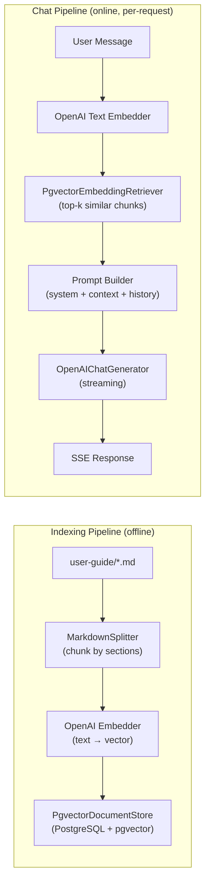
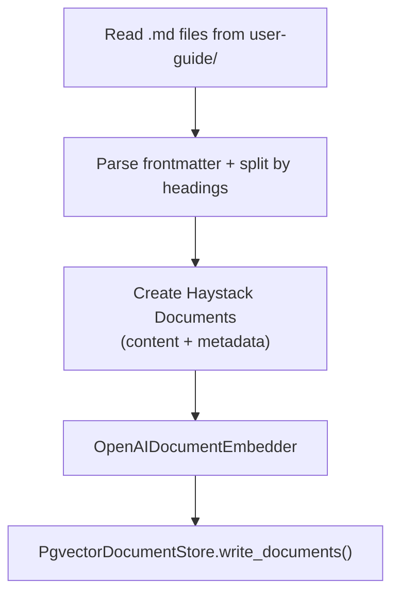
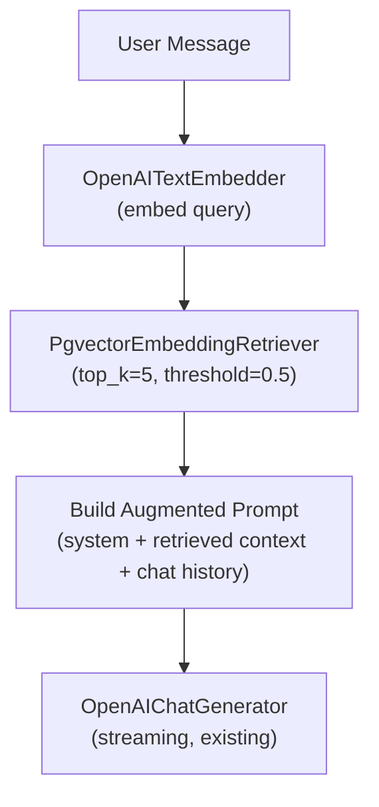

# 002 — User Guide on AI Assistant (James)

> Enrich James (the AI chat assistant) with knowledge from the Ownit user guide using a RAG (Retrieval-Augmented Generation) pipeline, so users can ask "how do I…?" questions and receive accurate, context-grounded answers about the platform.

## Meta

| Field           | Value                          |
|-----------------|--------------------------------|
| **Status**      | Draft                          |
| **Author**      | Agent + Ricardo                |
| **Created**     | 2026-06-16                     |
| **Updated**     | 2026-06-16                     |
| **Depends on**  | #001 (Chat Basics)             |
| **Supersedes**  | —                              |

---

## Problem Statement

James (spec #001) currently has no knowledge about the Ownit platform itself. When a user asks "how do I create a study plan?" or "where can I see my statistics?", James can only give generic answers based on the LLM's training data. The Ownit team maintains a comprehensive user guide (`user-guide/`) with detailed how-to documentation in Portuguese (pt-BR), but James has no way to access it.

This spec introduces a RAG (Retrieval-Augmented Generation) layer that:
1. Indexes the user-guide markdown documents into a vector store.
2. Retrieves relevant document chunks when a user sends a chat message.
3. Injects those chunks as context into the LLM prompt, so James gives accurate, platform-specific answers.

---

## Goals & Non-Goals

### Goals
- [ ] Index all user-guide markdown files into a vector store (pgvector in PostgreSQL).
- [ ] Automatically chunk and embed documents using a Haystack pipeline.
- [ ] Retrieve the most relevant document chunks when a user sends a chat message.
- [ ] Inject retrieved context into James's system prompt for grounded answers.
- [ ] Provide a standalone indexing script (`api/scripts/index_user_guide.py`) that can be triggered manually or via CI/CD.
- [ ] Store document metadata (source file, title, section) alongside embeddings for traceability.

### Non-Goals
- User-uploaded documents or custom knowledge bases — this spec only covers the built-in user guide.
- Automatic re-indexing on file change (file watcher) — re-indexing is triggered manually.
- Semantic search UI for end-users — the RAG is only used internally by James.
- RAG from student data (sessions, feedbacks, plans) — future spec.
- Multi-language support — the user guide is in pt-BR only.
- Fine-tuning or training a custom model.

---

## Proposed Solution

### Overview

The feature extends the existing chat pipeline (spec #001) with a retrieval layer:



**Key decisions:**
- **pgvector** as vector store — leverages the existing PostgreSQL instance, no new infrastructure.
- **Haystack** for both indexing and retrieval — consistent with the existing chat pipeline.
- **Section-level chunking** — markdown documents are split by headings (H1/H2/H3), keeping contextual coherence within each chunk.
- **Same embedding model** for indexing and retrieval — ensures vector space consistency.

### User Experience

The user experience is **transparent** — the user interacts with James exactly as before (spec #001). The difference is in the quality and accuracy of answers:

#### Before (spec #001)
```
User: Como eu crio um plano de estudo?
James: Para criar um plano de estudo, você pode organizar seus objetivos...
       (generic, non-specific answer)
```

#### After (spec #002)
```
User: Como eu crio um plano de estudo?
James: Para criar um plano de estudo no Ownit:
       1. Acesse a página **"Meus Planos"**
       2. Clique no botão **"+ Novo Plano"**
       3. Preencha o **Título**, **Descrição**, **Tags** e **Período**
       4. Clique em **"Salvar"**
       (accurate, platform-specific answer grounded in the user guide)
```

#### Edge Cases
- **No relevant context found**: If the retrieval returns no chunks above the similarity threshold, James responds using only his general knowledge (graceful fallback — no error).
- **Question unrelated to Ownit**: The retriever returns low-relevance chunks; the prompt instructs James to answer naturally without forcing irrelevant context.
- **User guide is empty/not indexed**: James works exactly as in spec #001 (no context injection).

### Data Model

#### pgvector Extension

The `pgvector` PostgreSQL extension must be enabled. This is done once via a migration.

```sql
CREATE EXTENSION IF NOT EXISTS vector;
```

#### `user_guide_documents` Table

Stores the chunked and embedded documents from the user guide.

```python
from pgvector.sqlalchemy import Vector

user_guide_documents = Table(
    'user_guide_documents',
    metadata,
    Column('id', UUID, primary_key=True, server_default=func.gen_random_uuid()),
    Column('content', String, nullable=False),           # Chunk text content
    Column('embedding', Vector(), nullable=False),       # Dimensionless vector (supports any model dimension)
    Column('source_file', String, nullable=False),       # e.g. "features/study-plan.md"
    Column('title', String, nullable=True),              # Extracted from frontmatter or H1
    Column('section', String, nullable=True),            # Section heading (H2/H3)
    Column('chunk_index', Integer, nullable=False),      # Order within the source file
    Column('metadata_', JSONB, nullable=True),           # Additional metadata (frontmatter, etc.)
    *timestamp_columns(),
)
```

> **Note on `Vector` dimension**: We define the column as a dimensionless `Vector()` rather than hardcoding `Vector(1536)`. This provides flexibility to switch embedding models with different output dimensions (e.g., from `1536` to `384`) simply by updating `EMBEDDING_DIMENSION` in settings and re-running the indexing script, without needing database schema migrations.

#### Index for Vector Similarity Search

```sql
CREATE INDEX ON user_guide_documents 
USING ivfflat (embedding vector_cosine_ops) 
WITH (lists = 10);
```

> `lists = 10` is appropriate for small datasets (< 1000 rows). The user guide currently has ~10 documents, yielding ~50-80 chunks.

#### Key Design Decisions
- **pgvector over a dedicated vector DB (Qdrant, Pinecone, etc.)**: The user guide is small (< 100 chunks). pgvector avoids adding infrastructure complexity. The existing PostgreSQL container is reused.
- **Separate table (not in `chat_messages`)**: Document embeddings are independent of chat data and have a different lifecycle (re-indexed when the user guide changes).
- **`source_file` + `chunk_index` as logical key**: Allows idempotent re-indexing (delete + re-insert by `source_file`).
- **`metadata_` column name**: Underscore suffix avoids conflict with SQLAlchemy's internal `metadata` attribute.

### API Endpoints

No new API endpoints are introduced. The existing chat endpoints from spec #001 are unchanged. The RAG context is injected transparently inside the chat pipeline.

> Indexing is handled by a standalone script, not by the API server. See [Indexing Script](#indexing-script) below.

### Haystack Pipelines

#### Indexing Pipeline

A dedicated module `api/src/features/chat/indexing.py` handles document ingestion.



**Chunking Strategy**: Split each markdown file by heading boundaries (H1, H2, H3). Each chunk includes:
- The heading text as `section` metadata.
- The content under that heading (until the next heading of equal or higher level).
- Frontmatter `title` is propagated to all chunks from that file.

This keeps chunks semantically coherent — each chunk is a self-contained "topic" from the user guide.

**Chunk size guardrail**: If a section exceeds 1500 characters, it is further split at paragraph boundaries (`\n\n`) to stay within the embedding model's optimal range.

```python
# Pseudocode for the indexing pipeline
from haystack import Document
from haystack.components.embedders import OpenAIDocumentEmbedder
from haystack_integrations.document_stores.pgvector import PgvectorDocumentStore

def create_document_store() -> PgvectorDocumentStore:
    settings = get_settings()
    return PgvectorDocumentStore(
        connection_string=settings.DATABASE_URL,
        table_name='user_guide_documents',
        embedding_dimension=settings.EMBEDDING_DIMENSION,
        vector_function='cosine_similarity',
        recreate_table=False,  # Table managed by Alembic
    )

def create_indexing_pipeline():
    doc_store = create_document_store()
    embedder = OpenAIDocumentEmbedder(
        api_key=Secret.from_token(settings.EMBEDDING_API_KEY),
        api_base_url=settings.EMBEDDING_BASE_URL,
        model=settings.EMBEDDING_MODEL,
    )
    return doc_store, embedder
```

#### Retrieval-Augmented Chat Pipeline

The existing `pipeline.py` is extended to include retrieval before generation.



**Retrieval parameters**:
- `top_k = 5` — Return at most 5 most relevant chunks.
- Similarity threshold: `0.5` — Chunks below this cosine similarity are discarded (prevents injecting irrelevant content).

**Augmented system prompt structure**:

```
{base_system_prompt}

## Contexto do Guia do Usuário

Abaixo estão trechos relevantes do guia do usuário do Ownit que podem ajudar 
a responder à pergunta do usuário. Use essas informações para dar respostas 
precisas e específicas sobre a plataforma.

Se a pergunta não for sobre o Ownit ou se o contexto abaixo não for relevante, 
responda normalmente sem forçar o uso dessas informações.

---
[Fonte: {source_file} > {section}]
{chunk_content}

---
[Fonte: {source_file} > {section}]
{chunk_content}

---
```

This approach (context in system prompt) is chosen over Haystack's `PromptBuilder` component because:
1. It integrates cleanly with the existing `build_haystack_messages()` function.
2. It keeps the streaming architecture from spec #001 unchanged.
3. The context is always in the system message, keeping the conversation history clean.

### Indexing Script

Indexing is a **standalone script** located at `api/scripts/index_user_guide.py`, completely decoupled from the backend service. It is triggered manually during development or automatically via CI/CD when the user guide content changes.

#### Running Locally

```bash
cd api && uv run python scripts/index_user_guide.py
```

The script:
1. Scans `user-guide/` for all `.md` files (recursively).
2. For each file: parses frontmatter, splits into chunks by headings, generates embeddings.
3. Deletes all existing rows in `user_guide_documents`.
4. Inserts all new chunks with embeddings.
5. Prints a summary (files processed, chunks created, time elapsed).
6. Exits with code `0` on success, `1` on failure.


### Configuration

New environment variables:

| Variable | Description | Default |
|----------|-------------|---------|
| `EMBEDDING_API_KEY` | API key for the dedicated embedding provider | (Required) |
| `EMBEDDING_BASE_URL` | Base URL for the embedding provider | `https://api.openai.com/v1` |
| `EMBEDDING_MODEL` | Model for generating embeddings | `text-embedding-3-small` |
| `EMBEDDING_DIMENSION` | Vector dimension matching the embedding model | `1536` |
| `RAG_TOP_K` | Number of chunks to retrieve per query | `5` |
| `RAG_SIMILARITY_THRESHOLD` | Minimum cosine similarity to include a chunk | `0.5` |
| `USER_GUIDE_PATH` | Path to the user-guide directory | `../user-guide` |

These are added to `Settings` in `core/config.py` with sensible defaults so the feature works out of the box.

### Frontend Components

No new frontend components are required. The RAG layer is entirely backend-side and transparent to the chat UI.

The only frontend consideration is that James's responses may now include references like "consulte [Planos de Estudo]" — these are already rendered as markdown links by the existing `MessageBubble` component (spec #001).

### Business Rules

1. **Indexing is idempotent**: Running the indexing pipeline multiple times produces the same result. All existing documents are deleted and re-inserted.
2. **Retrieval is best-effort**: If the vector store is empty or pgvector is unavailable, the chat pipeline falls back to spec #001 behavior (no context injection). This must never cause the chat to fail.
3. **Context window management**: Retrieved chunks are prepended to the system prompt. The total token count (system prompt + context + chat history) must respect the LLM's context window. If the combined context exceeds a safe limit (configurable, default 3000 tokens for the context portion), truncate by dropping the lowest-scoring chunks.
4. **Source attribution**: The augmented prompt includes source file and section references so James can cite them (e.g., "Para mais detalhes, consulte a seção Planos de Estudo no guia do usuário").
5. **User guide path resolution**: The `USER_GUIDE_PATH` setting is resolved relative to the API working directory. Defaults to `../user-guide`.
6. **Embedding model consistency**: The same embedding model and dimension must be used for both indexing and retrieval. Changing the model requires a full re-index.
7. **No user-specific data in the vector store**: The user guide is the same for all users. The `user_guide_documents` table has no `student_id` column.
8. **Indexing is decoupled from the API**: The indexing script runs independently of the backend service. The API server only reads from the `user_guide_documents` table, never writes to it.

---

## Implementation Plan

### Backend

1. **`api/pyproject.toml`** — Add dependencies: `pgvector`, `haystack-ai-integrations-pgvector` (for `PgvectorDocumentStore`).
2. **`api/src/core/config.py`** — Add new settings: `EMBEDDING_API_KEY`, `EMBEDDING_BASE_URL`, `EMBEDDING_MODEL`, `EMBEDDING_DIMENSION`, `RAG_TOP_K`, `RAG_SIMILARITY_THRESHOLD`, `USER_GUIDE_PATH`.
3. **`api/src/features/chat/tables.py`** — Add `user_guide_documents` table definition with `Vector` column.
4. **`api/scripts/index_user_guide.py`** — **[NEW]** Standalone indexing script:
   - `parse_markdown_file(path)` — Reads a markdown file, extracts frontmatter, splits into chunks by headings.
   - `scan_user_guide(directory)` — Recursively finds all `.md` files in the user-guide directory.
   - `run_indexing_pipeline()` — Full pipeline: scan → chunk → embed → store. Deletes existing documents first.
   - `if __name__ == '__main__'` entry point with summary output and exit codes.
5. **`api/src/features/chat/retrieval.py`** — **[NEW]** Retrieval module (used by the API at runtime):
   - `create_text_embedder()` — Creates an `OpenAITextEmbedder` for query embedding.
   - `retrieve_context(query, top_k, threshold)` — Embeds the query and retrieves relevant chunks from pgvector.
   - `format_context(documents)` — Formats retrieved chunks into the system prompt context block.
6. **`api/src/features/chat/prompts.py`** — Add `CONTEXT_PROMPT_TEMPLATE` for the augmented system prompt section.
7. **`api/src/features/chat/pipeline.py`** — Modify `build_haystack_messages()` to:
   - Call `retrieve_context()` with the latest user message.
   - Inject the formatted context into the system prompt.
8. **`.env.example`** — Add `EMBEDDING_API_KEY`, `EMBEDDING_BASE_URL`, `EMBEDDING_MODEL`, `EMBEDDING_DIMENSION`, `RAG_TOP_K`, `RAG_SIMILARITY_THRESHOLD`, `USER_GUIDE_PATH`.
9. **`docker-compose.yml`** — Change `pgsql` image to `pgvector/pgvector:pg18`.


### Migrations

1. Create migration for pgvector extension: `cd api && uv run alembic revision --autogenerate -m "enable pgvector extension"`
   - This migration must include `op.execute('CREATE EXTENSION IF NOT EXISTS vector')` in `upgrade()` and `op.execute('DROP EXTENSION IF EXISTS vector')` in `downgrade()`.
2. Create migration for table: `cd api && uv run alembic revision --autogenerate -m "add user_guide_documents table"`
3. Apply: `cd api && uv run alembic upgrade head`

> **Important**: Import `tables.py` in `api/migrations/env.py` to ensure Alembic detects the new table (already done for the chat tables from spec #001).

### Frontend

No frontend changes required.

---

## Testing Strategy

### Backend Tests

#### Unit Tests

- `test_parse_markdown_file`: Verifies frontmatter extraction, heading-based splitting, and chunk metadata.
- `test_parse_markdown_large_section`: Verifies that sections exceeding the max chunk size are split at paragraph boundaries.
- `test_scan_user_guide`: Verifies recursive `.md` file discovery in the user-guide directory.
- `test_format_context`: Verifies the formatted context string includes source attribution and content.
- `test_format_context_empty`: Returns empty string when no documents are retrieved.
- `test_build_haystack_messages_with_context`: Verifies the system prompt includes retrieved context.
- `test_build_haystack_messages_no_context`: Verifies fallback to base system prompt when no context is available.

#### Integration Tests

- `test_indexing_pipeline`: Runs the full indexing pipeline against a test user-guide directory, verifies documents are stored in pgvector.
- `test_indexing_idempotent`: Runs indexing twice, verifies document count remains the same.
- `test_retrieval`: Indexes test documents, queries with a relevant question, verifies the correct chunks are returned.
- `test_retrieval_threshold`: Queries with an irrelevant question, verifies no chunks are returned (below threshold).

> **Note**: Integration tests require the pgvector extension enabled in the test PostgreSQL container. The testcontainers setup must use a PostgreSQL image with pgvector (e.g., `pgvector/pgvector:pg18`).

#### Pipeline Tests (with mocked embedder)

- `test_rag_pipeline_with_context`: Mock the embedder and retriever to return fixed chunks. Verify they appear in the system prompt sent to the generator.
- `test_rag_pipeline_fallback`: Mock the retriever to return empty results. Verify the pipeline still works with the base system prompt.

### Manual Verification

1. Start the database with `docker compose up pgsql`.
2. Run the indexing script locally: `cd api && uv run python scripts/index_user_guide.py`.
3. Verify the script output shows files processed, chunks created, and a success message.
4. Verify the `user_guide_documents` table contains the expected number of rows with non-null embeddings.
5. Start the full stack with `docker compose up`.
6. Open the chat and ask: "Como eu crio um plano de estudo?"
7. Verify James's answer includes specific Ownit instructions (button names, page names, steps).
8. Ask: "O que é o timer Pomodoro?" — Verify answer references Ownit's Pomodoro feature.
9. Ask a non-Ownit question: "Qual a capital da França?" — Verify James answers normally without forcing user-guide context.
10. Re-run the indexing script — verify the table is refreshed (same document count, updated timestamps).

---

## Decision Log

| Date | Decision | Rationale |
|------|----------|-----------|
| 2026-06-16 | pgvector over dedicated vector DB | User guide is small (< 100 chunks); avoids adding infrastructure. Reuses existing PostgreSQL. |
| 2026-06-16 | Context in system prompt (not PromptBuilder) | Preserves spec #001 streaming architecture; keeps conversation history clean. |
| 2026-06-16 | Heading-based chunking | User guide is well-structured with clear headings. Each section is a natural semantic unit. |
| 2026-06-16 | No frontend changes | RAG is transparent to the user. James simply gives better answers. |
| 2026-06-16 | Idempotent full re-index (delete + insert) | User guide is small; incremental indexing adds complexity without significant benefit. |
| 2026-06-16 | Indexing as standalone script (not API endpoint) | Decouples indexing from the runtime API. Avoids admin auth complexity. Re-indexing is a deployment-time concern, not a runtime concern. |
| 2026-06-16 | Switch PostgreSQL image to `pgvector/pgvector:pg18` | Pre-packages the pgvector extension, avoiding manual compilation or custom Dockerfiles. |
| 2026-06-16 | Separate embedding provider | DeepSeek does not offer an embedding API, so a dedicated embedding provider (like OpenAI) must be used. |
| 2026-06-16 | No chunk overlap | Simpler chunking logic, relying solely on natural heading boundaries for semantic coherence. |

---

## References

- [Haystack — PgvectorDocumentStore](https://docs.haystack.deepset.ai/docs/pgvectordocumentstore)
- [Haystack — Indexing Pipeline](https://docs.haystack.deepset.ai/docs/indexing-pipelines)
- [Haystack — RAG Pipeline](https://docs.haystack.deepset.ai/docs/rag-pipelines)
- [pgvector — PostgreSQL Extension](https://github.com/pgvector/pgvector)
- [pgvector/pgvector Docker Image](https://hub.docker.com/r/pgvector/pgvector)
- [OpenAI Embeddings](https://platform.openai.com/docs/guides/embeddings)
- [001 — Chat Basics](./001_chat_basics.md)
- [Ownit User Guide](../../user-guide/index.md)