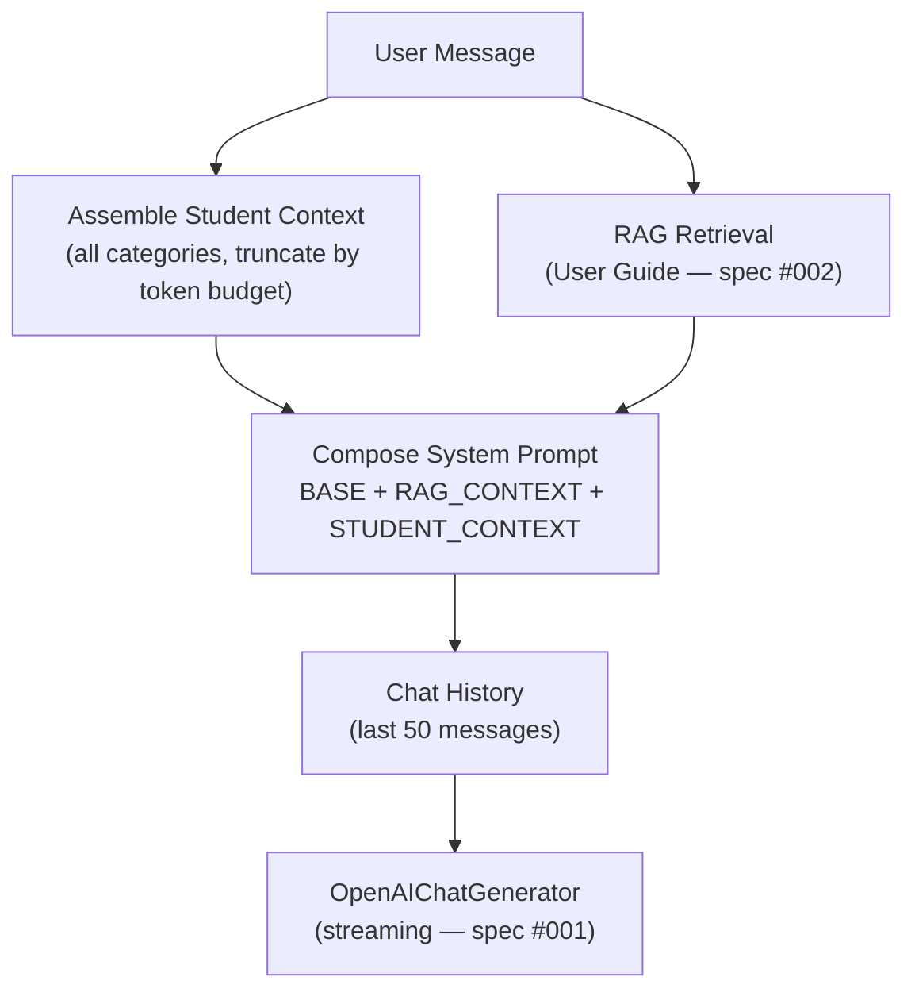

# 003 — Student Context Injection for AI Chat

> Enrich James (the AI assistant) with personalized student data — goals, study sessions, analytics metrics, and real-time state — via context injection into the system prompt, so conversations are grounded in the student's actual learning journey.

## Meta

| Field           | Value                          |
|-----------------|--------------------------------|
| **Status**      | Draft                          |
| **Author**      | Agent + Ricardo                |
| **Created**     | 2026-06-22                     |
| **Updated**     | 2026-06-22                     |
| **Depends on**  | #001 (Chat Basics), #002 (User Guide RAG) |
| **Supersedes**  | —                              |

---

## Problem Statement

James (specs #001 and #002) can answer questions about the Ownit platform (via RAG) and hold multi-turn conversations, but he knows **nothing** about the student he's talking to. He doesn't know their goals, study progress, session history, or whether they're in the middle of a Pomodoro right now.

This means every response is generic. When a student asks "como estou indo?" or "o que devo estudar agora?", James can only give vague advice instead of saying "Você completou 45% do seu objetivo de Cálculo II e tem uma sessão de Séries de Taylor planejada para amanhã às 10h."

The system already stores rich, reflective student data — self-evaluations (`rating`, `domain_perception_level`), strategies used, final comments, session notes — that represent **exactly** the kind of information a Self-Regulated Learning assistant needs. This spec bridges that gap by injecting relevant student data into the LLM's context.

---

## Goals & Non-Goals

### Goals
- [ ] Inject the student's name and profile into the system prompt for personalized conversations.
- [ ] Inject the student's active goals (with progress) so James knows what they're working toward.
- [ ] Inject recent study session summaries (including self-evaluations, strategies, and reflective comments) so James can reference past learning.
- [ ] Inject aggregated analytics metrics (performance summary, strategy adherence) for quantitative feedback.
- [ ] Inject real-time state (active session, Pomodoro status, upcoming sessions) for situational awareness.
- [ ] Enforce a configurable token budget for the student context block to avoid exceeding the LLM's context window. When the full context exceeds the budget, lower-priority categories are dropped.

### Non-Goals
- Function calling / tool use by the LLM — the context is pre-fetched and injected, not fetched on-demand by the model.
- Storing or caching the assembled context — it is built fresh per request.
- New API endpoints — context assembly is internal to the chat pipeline.
- Frontend changes — this is entirely backend-side, transparent to the chat UI.
- New database tables or migrations — all data comes from existing tables.
- Fine-tuning or training the model on student data.

---

## Proposed Solution

### Overview

A new module `api/src/features/chat/context.py` assembles a personalized context string from existing data sources and injects it into the system prompt alongside the RAG context (spec #002). **All available data categories are always fetched and injected**, with the only control being a configurable token budget that truncates lower-priority categories when the total exceeds the limit.



The system prompt composition order:
1. `SYSTEM_PROMPT` — base personality and guidelines (existing)
2. `CONTEXT_PROMPT_TEMPLATE` — RAG context from user guide (existing, spec #002)
3. **`STUDENT_CONTEXT_PROMPT_TEMPLATE`** — personalized student data (**new**)

### User Experience

The user experience is **transparent** — the student interacts with James exactly as before. The difference is in the quality and personalization of responses.

#### Before (specs #001 + #002)
```
User: Como estou indo nos meus estudos?
James: Para acompanhar seu progresso, acesse a página de Estatísticas...
       (correct about the platform, but doesn't know YOUR progress)
```

#### After (spec #003)
```
User: Como estou indo nos meus estudos?
James: Olá Ricardo! Aqui está um resumo dos seus estudos:

       **Cálculo II** (45% concluído, prazo em 22 dias):
       - 12.5 horas dedicadas em 18 sessões
       - Rating médio: 3.8/5 — tendência de melhora! 📈
       - Sua estratégia mais eficaz: exercícios (85% de aderência)
       - Na última sessão, você mencionou que precisa praticar mais
         integrais por partes. Quer que eu sugira exercícios?

       **Projeto ML** (20% concluído, prazo em 39 dias):
       - 3 sessões realizadas até agora
       - Percebi que você cancelou a sessão de ontem. Tudo bem?
```

#### Edge Cases
- **No goals or sessions**: James receives a context noting the student is new. He can offer onboarding guidance ("Que tal criar sua primeira meta?").
- **Context exceeds token budget**: Lower-priority categories are dropped entirely in order (recent events → metrics → recent sessions → upcoming sessions). Profile and active goals are always kept.
- **Database query fails**: Context assembly catches exceptions per category and falls back gracefully. If all queries fail, only the base prompt is used (never blocks the chat). A warning is logged.
- **Student has many goals/sessions**: Only active goals (`status = doing`) and recent sessions (last 7 days, max 10) are included. Completed/deleted goals are excluded.

### Data Sources

No new data model is required. All data is read from existing tables and services:

| Data Category | Source Table(s) | Existing Service Function |
|---------------|-----------------|--------------------------|
| Student Profile | `students` | `auth.service.get_student()` |
| Active Goals | `goals` | `goal.service.list_goals(status=doing)` |
| Goal Progress | `goals` + `study_sessions` | `goal.service.list_goals()` (calculates progress) |
| Recent Sessions | `study_sessions` | **New query** (last 7 days, done/canceled) |
| Active Session | `study_sessions` | **New query** (status = doing) |
| Upcoming Sessions | `study_sessions` | **New query** (status = todo, future) |
| Performance Summary | `events` + `study_sessions` | `analytics.service.get_goal_performance_summary()` |
| Strategy Adherence | `events` + `study_sessions` | `analytics.service.get_strategy_metrics()` |
| Recent Events | `events` | **New query** (last 10 events) |
| Pomodoro State | `study_session_pomodoros` | Joined via active session query |

### API Endpoints

No new API endpoints. The context assembly is internal to the chat pipeline. The existing `POST /chat/sessions/{session_id}/messages` endpoint behavior is unchanged from the client's perspective.

### Context Prompt Template

```python
STUDENT_CONTEXT_PROMPT_TEMPLATE = (
    '## Contexto do Estudante\n\n'
    'Abaixo estão informações sobre o estudante com quem você está conversando. '
    'Use esses dados para personalizar suas respostas e dar conselhos específicos '
    'baseados na situação real do estudante.\n\n'
    'IMPORTANTE: Integre essas informações naturalmente na conversa. '
    'NÃO liste dados brutos ou repita números sem contexto. '
    'Conecte as informações ao que o estudante está perguntando.\n\n'
    '{student_context}'
)
```

### Context Block Format

Each data category is rendered as a markdown section within the context block. Example of a fully assembled context:

```markdown
### Perfil
- Nome: Ricardo
- Na plataforma desde: 15/05/2026

### Metas Ativas (2)
1. **Aprender Cálculo II** — 45% concluído, prazo em 22 dias
   - Tags: matemática, cálculo
   - 18 sessões concluídas, rating médio: 3.8
2. **Projeto de Machine Learning** — 20% concluído, prazo em 39 dias
   - Tags: python, ml, projeto
   - 3 sessões concluídas

### Sessões Recentes (últimos 7 dias)
- "Integrais por partes" (Cálculo II) — concluída em 22/06
  Rating: 4.0/5 | Dificuldade: 4/5 | Domínio: 3/5
  Estratégias: resumo, exercícios
  Comentário: "Entendi o conceito mas preciso praticar mais"
- "Setup do ambiente" (Projeto ML) — cancelada em 21/06

### Métricas de Desempenho
- Cálculo II: 12.5h dedicadas, 42min por sessão em média
  Estratégias mais eficazes: exercícios (85% aderência), resumo (72%)
  Tendência semanal: rating subiu de 3.2 → 4.0

### Estado Atual
- Nenhuma sessão ativa no momento
- Próxima sessão: "Séries de Taylor" (Cálculo II) — amanhã às 10:00
```

### Token Budget

A new config setting `STUDENT_CONTEXT_MAX_TOKENS` controls the maximum token count for the student context block. The budget is enforced after assembly: if the full context exceeds the budget, categories are truncated in this priority order (lowest priority removed first):

1. Recent Events (dropped first)
2. Metrics / Performance
3. Recent Sessions
4. Upcoming Sessions
5. Active Goals (always kept)
6. Profile (always kept)

Token counting uses `tiktoken` with the `cl100k_base` encoding (same as the RAG `ContextFilter` in spec #002).

| Config | Default | Description |
|--------|---------|-------------|
| `STUDENT_CONTEXT_MAX_TOKENS` | `1500` | Max tokens for the student context block |

### Architecture: New Module

#### `api/src/features/chat/context.py`

This is the core new module. It has two responsibilities:

1. **Fetch all data categories** from existing services/tables (with per-category error handling).
2. **Format and truncate** the context block within the token budget.

```python
# Key function signatures

def fetch_student_context(
    conn: Connection,
    student_id: int,
) -> StudentContext:
    """Fetch all data categories from existing services."""

def format_student_context(context: StudentContext) -> str:
    """Format the StudentContext into a markdown string for the prompt."""

def truncate_context(formatted: str, max_tokens: int) -> str:
    """Enforce the token budget by removing low-priority sections."""

def build_student_context(
    conn: Connection,
    student_id: int,
    max_tokens: int,
) -> str:
    """Main entry point. Fetches all data, formats, and truncates."""
```

#### `StudentContext` Data Class

```python
@dataclass
class StudentContext:
    name: str
    member_since: datetime
    active_goals: list[GoalContextItem]
    recent_sessions: list[SessionContextItem] | None = None
    metrics: list[GoalMetricsContextItem] | None = None
    active_session: ActiveSessionContextItem | None = None
    upcoming_sessions: list[UpcomingSessionContextItem] | None = None
    recent_events: list[EventContextItem] | None = None
```

### Integration Point

The `build_haystack_messages()` function in `pipeline.py` is the integration point. It currently composes `SYSTEM_PROMPT` + RAG context. The change adds the student context as a third block:

**Before:**
```python
def build_haystack_messages(
    history: list[dict[str, str]],
    rag_pipeline: Pipeline,
    context: str | None = None,
) -> list[ChatMessage]:
    if context is None:
        context = _fetch_rag_context_for_query(history, rag_pipeline)

    system_prompt = SYSTEM_PROMPT
    if context:
        system_prompt = f'{system_prompt}\n\n{context}'
    ...
```

**After:**
```python
def build_haystack_messages(
    history: list[dict[str, str]],
    rag_pipeline: Pipeline,
    rag_context: str | None = None,
    student_context: str | None = None,
) -> list[ChatMessage]:
    if rag_context is None:
        rag_context = _fetch_rag_context_for_query(history, rag_pipeline)

    system_prompt = SYSTEM_PROMPT
    if rag_context:
        system_prompt = f'{system_prompt}\n\n{rag_context}'
    if student_context:
        system_prompt = f'{system_prompt}\n\n{student_context}'
    ...
```

The `send_message` route in `routes.py` calls `build_student_context()` before `build_haystack_messages()`:

```python
# In send_message route, after building chat history:
student_context = build_student_context(
    conn, student_id, settings.STUDENT_CONTEXT_MAX_TOKENS,
)
messages = build_haystack_messages(
    history, rag_pipeline, student_context=student_context,
)
```

### Business Rules

1. **All data categories are always fetched and injected.** There is no selective loading or message-based filtering. The LLM always has full awareness of the student's state.
2. **Only active goals (`status = doing`) are included.** Completed, todo, and canceled goals are excluded to keep context relevant.
3. **Recent sessions are limited to the last 7 days**, max 10 sessions, ordered by `planned_to_start_at DESC`.
4. **Metrics are only fetched for active goals** to avoid expensive queries on archived data.
5. **Context assembly must never block or fail the chat.** If any data fetch raises an exception, that category is silently skipped and the remaining context is still injected. A warning is logged.
6. **The token budget is a hard limit.** If the assembled context exceeds `STUDENT_CONTEXT_MAX_TOKENS`, categories are dropped entirely starting from the lowest priority (recent events → metrics → recent sessions → upcoming sessions). Profile and active goals are always kept.
7. **The student context is assembled fresh on every message.** There is no caching. This ensures data is always current (e.g., a session that just finished is immediately reflected).
8. **The context is injected into the system prompt**, not as a separate message in the chat history. This keeps the conversation history clean and avoids confusing the LLM.

---

## Implementation Plan

### Backend

1. **`api/src/core/config.py`** — Add `STUDENT_CONTEXT_MAX_TOKENS: int = 1500` to the `Settings` class.
2. **`api/src/features/chat/context.py`** — **[NEW]** Core module with:
   - `StudentContext` and related dataclasses (`GoalContextItem`, `SessionContextItem`, `ActiveSessionContextItem`, `UpcomingSessionContextItem`, `GoalMetricsContextItem`, `EventContextItem`).
   - `fetch_student_context(conn, student_id) -> StudentContext` — orchestrates data fetching from existing services, with per-category error handling.
   - `format_student_context(context: StudentContext) -> str` — renders the markdown context block.
   - `truncate_context(formatted: str, max_tokens: int) -> str` — enforces the token budget by removing low-priority sections.
   - `build_student_context(conn, student_id, max_tokens) -> str` — main entry point composing the above.
3. **`api/src/features/chat/context_queries.py`** — **[NEW]** Dedicated query functions not covered by existing services:
   - `get_recent_sessions(conn, student_id, days=7, limit=10)` — recent done/canceled sessions with evaluations.
   - `get_active_doing_session(conn, student_id)` — session with status `doing`, joined with Pomodoro.
   - `get_upcoming_sessions(conn, student_id, limit=5)` — future `todo` sessions.
   - `get_recent_events(conn, student_id, limit=10)` — last N events with context JSONB.
4. **`api/src/features/chat/prompts.py`** — Add `STUDENT_CONTEXT_PROMPT_TEMPLATE` constant.
5. **`api/src/features/chat/pipeline.py`** — Modify `build_haystack_messages()` to accept an optional `student_context` parameter and append it to the system prompt.
6. **`api/src/features/chat/routes.py`** — Modify `send_message()` to call `build_student_context()` before `build_haystack_messages()`, passing the result as `student_context`.
7. **`api/tests/conftest.py`** — Add `STUDENT_CONTEXT_MAX_TOKENS=1500` to `get_test_settings()`.

### Migrations

No database migrations required. All data is read from existing tables.

### Frontend

No frontend changes required.

---

## Testing Strategy

### Backend Tests

#### Unit Tests (`context.py`)

- `test_format_student_context_full`: Full `StudentContext` with all categories populated → valid markdown with all sections.
- `test_format_student_context_new_student`: Student with no goals or sessions → short markdown noting the student is new.
- `test_format_student_context_no_sessions`: Active goals but no recent sessions → goals section present, sessions section absent.
- `test_format_student_context_active_pomodoro`: Student with an active Pomodoro → "Estado Atual" section includes Pomodoro details.
- `test_truncate_context_within_budget`: Context within budget → unchanged.
- `test_truncate_context_exceeds_budget`: Context exceeds budget → lowest-priority sections (events, metrics) are dropped; profile and goals remain.
- `test_truncate_context_very_small_budget`: Very small budget → only profile and active goals remain.
- `test_build_student_context_graceful_failure`: Mock a service to raise → context still assembles without that category + warning logged.
- `test_build_student_context_all_queries_fail`: All fetches raise → returns empty string (graceful fallback).

#### Unit Tests (`context_queries.py`)

- `test_get_recent_sessions`: Returns sessions from last 7 days only, ordered by date DESC.
- `test_get_recent_sessions_empty`: No sessions → empty list.
- `test_get_active_doing_session`: Returns the session with status `doing`, with Pomodoro data joined.
- `test_get_active_doing_session_none`: No active session → `None`.
- `test_get_upcoming_sessions`: Returns future `todo` sessions ordered by `planned_to_start_at ASC`.
- `test_get_recent_events`: Returns last N events with JSONB context.

#### Integration Tests

- `test_send_message_includes_student_context`: Send a message → verify the system prompt sent to the LLM contains the student's goal data and session data. (Requires mocking the LLM generator to capture the messages it receives.)

### Manual Verification

1. Start the full stack with `docker compose up`.
2. Log in as a test user who has goals and study sessions.
3. Open the chat and send: "Como estou indo nos meus estudos?"
4. Verify James's response references the student's actual goals, progress, and session data.
5. Send: "O que estudei essa semana?" — Verify response mentions recent sessions with specific titles and evaluations.
6. Send: "oi" — Verify James still gives a personalized greeting that acknowledges the student's context.
7. Send: "Qual a capital da França?" — Verify James answers correctly without forcing student data into the response (the prompt instructs the LLM to integrate context naturally).
8. Start a Pomodoro session in the UI, then ask: "Quanto tempo falta?" — Verify James knows about the active session.
9. Check API logs for any warnings about context assembly failures.
10. Monitor token usage in `llm_metadata` — verify context injection adds a consistent ~800-1500 tokens per message.

---

## Open Questions

---

## Decision Log

| Date | Decision | Rationale |
|------|----------|-----------|
| 2026-06-22 | Context injection over function calling | DeepSeek V4 Lite may not handle tool use reliably; context injection preserves the existing streaming architecture without adding latency; the data volume is small enough (~1500 tokens) to not warrant dynamic fetching. |
| 2026-06-22 | Always inject all categories (no heuristics) | Simpler implementation, no keyword maintenance, the LLM decides what's relevant from the context. Token budget with priority-based truncation is sufficient to control costs. |
| 2026-06-22 | No caching of assembled context | Student data can change between messages (session finished, goal updated). Fresh assembly ensures accuracy. The queries are lightweight (single student, small data volume). |
| 2026-06-22 | Token budget with priority-based truncation | Predictable behavior under all circumstances. Profile + active goals always fit within even a small budget. |
| 2026-06-22 | Separate `context.py` and `context_queries.py` modules | Follows the project's separation of concerns. `context.py` handles orchestration/formatting, `context_queries.py` handles data access. Avoids bloating existing service files. |

---

## References

- [001 — Chat Basics](./001_chat_basics.md)
- [002 — User Guide RAG](./002_chat_user_guide.md)
- [Context Injection Analysis Report](../../.gemini/antigravity-ide/brain/21afcac9-a0b1-4f66-a6f5-07182cd39518/context_injection_report.md)
- [Haystack — Chat Generators](https://docs.haystack.deepset.ai/docs/generators)
