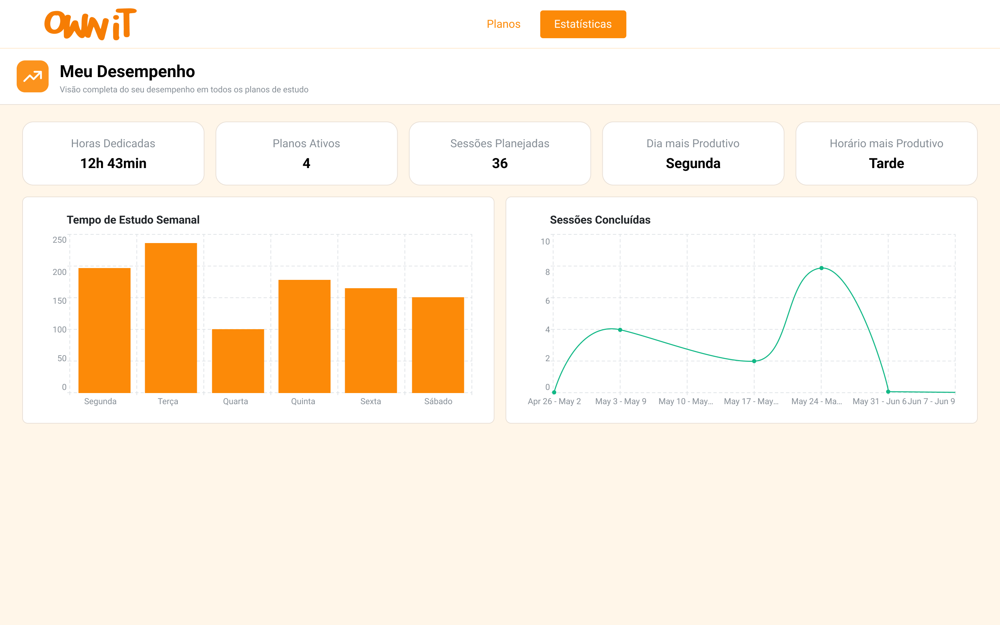

# Desempenho

A página de Desempenho (Estatísticas) oferece uma visão completa do seu
progresso em todos os planos de estudo. Aqui você encontra métricas
consolidadas e gráficos que ajudam a entender seus padrões de estudo e
identificar oportunidades de melhoria.

## Acessando as Estatísticas

Clique em **"Estatísticas"** na barra de navegação superior da plataforma
para acessar o painel de desempenho.

---

## Métricas Gerais

No topo da página, cinco cards apresentam as métricas consolidadas:

| Métrica | Descrição | Exemplo |
|---------|-----------|---------|
| **Horas Dedicadas** | Total de horas investidas em estudo | 12h 43min |
| **Planos Ativos** | Quantidade de planos em andamento | 4 |
| **Sessões Planejadas** | Total de sessões agendadas | 36 |
| **Dia mais Produtivo** | O dia da semana em que você mais estuda | Segunda |
| **Horário mais Produtivo** | O turno do dia em que você é mais produtivo | Tarde |

Essas métricas são atualizadas automaticamente conforme você realiza sessões
e finaliza feedbacks.

---

## Gráficos

### Tempo de Estudo Semanal

Gráfico de **barras** que exibe a distribuição do tempo de estudo (em minutos)
ao longo dos dias da semana (Segunda a Sábado).

**Como interpretar:**

- Barras mais altas indicam os dias em que você mais estudou.
- Compare a distribuição para identificar se seu estudo está concentrado em
  poucos dias ou bem distribuído ao longo da semana.
- Use essa informação para ajustar seu planejamento e balancear a carga
  de estudo.

### Sessões Concluídas

Gráfico de **linha** que mostra a evolução do número de sessões concluídas
por semana ao longo do tempo.

**Como interpretar:**

- Uma linha ascendente indica aumento na frequência de estudo.
- Quedas podem indicar períodos de menor engajamento.
- O gráfico ajuda a visualizar tendências de longo prazo na sua consistência
  de estudo.

---

## Métricas por Plano

Além das métricas gerais, cada [Plano de Estudo](./study-plan.md) possui
suas próprias métricas de desempenho, visíveis na página de detalhes do
plano:

| Métrica | Descrição |
|---------|-----------|
| **Horas Dedicadas** | Total de horas investidas naquele plano específico |
| **Tempo Médio por Sessão** | Média de duração das sessões do plano |
| **Estratégia Favorita** | A estratégia de estudo mais utilizada no plano |

Essas métricas são alimentadas pelos [Feedbacks](./feedbacks.md) enviados
ao final de cada sessão.

---

## Como as Métricas são Calculadas

As estatísticas são geradas a partir de três fontes de dados:

1. **Sessões de Estudo** — Duração planejada e real das sessões.
2. **Feedbacks** — Avaliações de planejamento, domínio, dificuldade e
   estratégias utilizadas.
3. **Planos de Estudo** — Status, progresso e prazos dos planos.

Quanto mais sessões você completar e mais feedbacks enviar, mais precisas e
úteis serão suas estatísticas.

---

## Boas Práticas

- **Consulte regularmente** — Acesse as estatísticas semanalmente para
  acompanhar tendências.
- **Compare períodos** — Observe a evolução dos gráficos ao longo das
  semanas para avaliar seu progresso.
- **Ajuste seu planejamento** — Use os insights das métricas (como dia e
  horário mais produtivo) para otimizar seus planos.
- **Finalize sempre com feedback** — Dados incompletos geram métricas
  imprecisas. Sempre preencha o feedback ao final da sessão.

---

*Próximo: Conheça o [Assistente de IA](./ai-assistant.md) e como ele pode
ajudar a melhorar seus estudos.*
