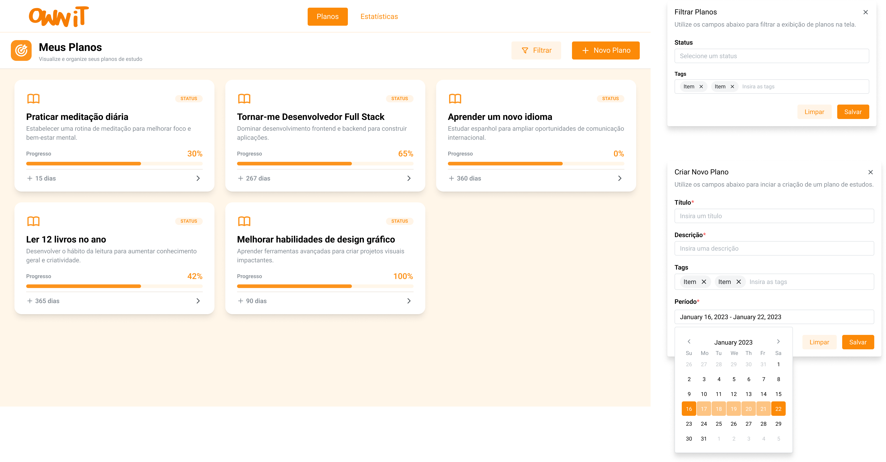
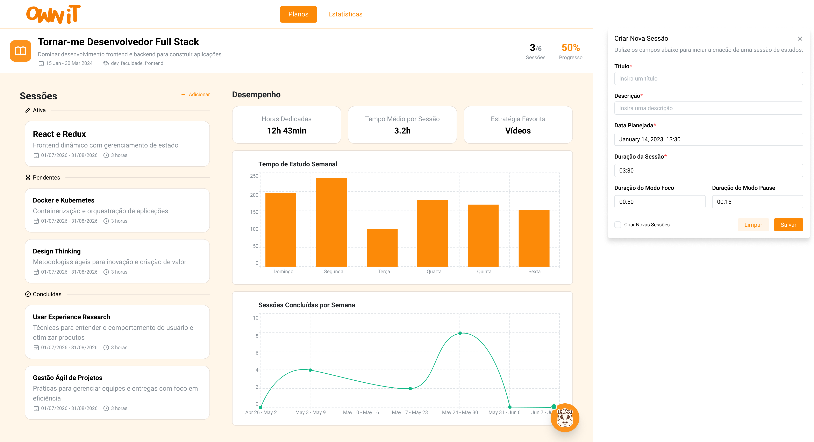

# Planos de Estudo

Os Planos de Estudo são o ponto de partida do seu aprendizado no Ownit. Eles
permitem que você organize seus objetivos em estruturas claras, com prazos
definidos e acompanhamento de progresso.

## Visão Geral

A página **"Meus Planos"** é o hub central onde você pode visualizar, criar,
filtrar e acessar todos os seus planos de estudo.

### Elementos da Página

- **Cards de Planos** — Cada plano é exibido como um card com título,
  descrição, barra de progresso e duração restante.
- **Status** — Cada plano possui um indicador de status visível no card.
- **Progresso** — Barra de progresso com percentual (ex: 30%, 65%, 100%).
- **Duração** — Indicador de dias restantes (ex: "+ 15 dias", "+ 267 dias").
- **Botão "+ Novo Plano"** — Para criar um novo plano de estudo.
- **Botão "Filtrar"** — Para filtrar planos por status e tags.

---

## Criando um Novo Plano

Clique no botão **"+ Novo Plano"** para abrir o formulário de criação.

### Campos do Formulário

| Campo | Descrição | Obrigatório |
|-------|-----------|:-----------:|
| Título | Nome do plano de estudo | ✅ |
| Descrição | Breve descrição do objetivo do plano | ✅ |
| Tags | Palavras-chave para categorização | ❌ |
| Período | Datas de início e fim do plano | ✅ |

### Passo a Passo

1. Clique em **"+ Novo Plano"** no canto superior direito da página.
2. Insira um **Título** descritivo (ex: "Tornar-me Desenvolvedor Full Stack").
3. Adicione uma **Descrição** com o objetivo principal do plano
   (ex: "Dominar desenvolvimento frontend e backend para construir aplicações").
4. (Opcional) Adicione **Tags** para organizar seus planos por categoria.
   Digite a tag e pressione Enter para adicioná-la.
5. Selecione o **Período** utilizando o calendário integrado. Clique na data
   de início e na data de fim para definir o intervalo.
6. Clique em **"Salvar"** para criar o plano. Use **"Limpar"** caso queira
   resetar o formulário.

> **Dica:** Use tags consistentes como "dev", "faculdade", "idiomas" para
> facilitar a filtragem posterior dos seus planos.

---

## Filtrando Planos

Utilize o botão **"Filtrar"** para localizar planos específicos.

### Filtros Disponíveis

| Filtro | Descrição |
|--------|-----------|
| Status | Filtra por status do plano (ativo, concluído, etc.) |
| Tags | Filtra pelas tags associadas ao plano |

Selecione os filtros desejados e clique em **"Salvar"** para aplicar. Use
**"Limpar"** para remover todos os filtros.

---

## Página de Detalhes do Plano

Ao clicar em um plano na lista, você acessa a página de detalhes com todas
as informações e ferramentas relacionadas.

### Informações do Cabeçalho

No topo da página, você encontra:

- **Título e descrição** do plano.
- **Período** — Datas de início e fim (ex: "15 Jan - 30 Mar 2024").
- **Tags** — As tags associadas ao plano.
- **Contagem de sessões** — Número de sessões realizadas sobre o total
  (ex: "3/6 Sessões").
- **Progresso** — Percentual geral de conclusão do plano (ex: "50%").

### Sessões de Estudo

As sessões são organizadas em três categorias:

| Categoria | Descrição |
|-----------|-----------|
| **Ativa** | A sessão que está sendo realizada no momento |
| **Pendentes** | Sessões agendadas que ainda não foram iniciadas |
| **Concluídas** | Sessões que já foram finalizadas |

Cada sessão exibe:
- Título e descrição do conteúdo.
- Período do plano ao qual pertence.
- Duração estimada.

Para adicionar uma nova sessão, consulte
[Sessões de Estudo](./study-session.md).

### Desempenho do Plano

Na lateral direita da página, são exibidas métricas de desempenho específicas
do plano:

- **Horas Dedicadas** — Total de horas investidas no plano (ex: "12h 43min").
- **Tempo Médio por Sessão** — Média de duração das sessões (ex: "3.2h").
- **Estratégia Favorita** — A estratégia de estudo mais utilizada
  (ex: "Vídeos").

### Gráficos de Acompanhamento

Dois gráficos ajudam a visualizar o progresso:

- **Tempo de Estudo Semanal** — Gráfico de barras mostrando os minutos
  estudados por dia da semana (Domingo a Sexta).
- **Sessões Concluídas por Semana** — Gráfico de linha mostrando a evolução
  das sessões concluídas ao longo das semanas.

### Assistente James

O ícone do **James** aparece no canto inferior direito da página do plano.
Clique nele para receber sugestões personalizadas. Para mais detalhes,
consulte [Assistente de IA](./ai-assistant.md).

---

## Boas Práticas

- **Defina prazos realistas** — Considere sua disponibilidade ao definir o
  período do plano.
- **Use títulos claros** — Facilita a identificação rápida dos seus planos.
- **Categorize com tags** — Mantenha seus planos organizados por área de
  conhecimento.
- **Acompanhe o progresso** — Consulte regularmente as métricas e gráficos
  para avaliar seu desempenho.
- **Divida em sessões** — Planos grandes funcionam melhor quando divididos em
  sessões menores e focadas.

---

*Próximo: Aprenda a criar e executar [Sessões de Estudo](./study-session.md)
dentro dos seus planos.*
