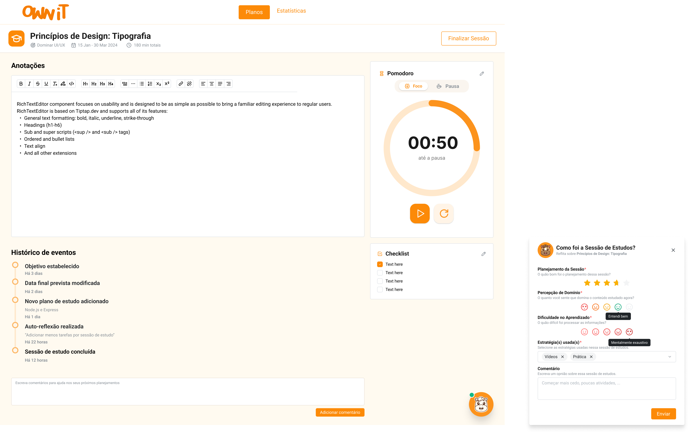

# Sessões de Estudo

As Sessões de Estudo são o momento em que o aprendizado acontece de fato. Dentro
de cada sessão, você tem acesso a ferramentas de foco, anotações, checklists e
um timer Pomodoro integrado para maximizar sua produtividade.

## Criando uma Nova Sessão

As sessões são criadas dentro de um [Plano de Estudo](./study-plan.md). Na página
de detalhes do plano, clique em **"+ Adicionar"** para abrir o formulário de
criação.

### Campos do Formulário

| Campo | Descrição | Obrigatório |
|-------|-----------|:-----------:|
| Título | Nome da sessão de estudo | ✅ |
| Descrição | Detalhes do conteúdo a ser estudado | ✅ |
| Data Planejada | Data e horário planejados para a sessão | ✅ |
| Duração da Sessão | Tempo total previsto (ex: 03:30) | ✅ |
| Duração do Modo Foco | Duração do ciclo de foco do Pomodoro (ex: 00:50) | ❌ |
| Duração do Modo Pausa | Duração da pausa entre ciclos (ex: 00:15) | ❌ |
| Criar Novas Sessões | Opção para criar múltiplas sessões de uma vez | ❌ |

### Passo a Passo

1. Acesse a página de um [Plano de Estudo](./study-plan.md) e clique em
   **"+ Adicionar"**.
2. Insira um **Título** descritivo (ex: "React e Redux").
3. Adicione uma **Descrição** do conteúdo
   (ex: "Frontend dinâmico com gerenciamento de estado").
4. Selecione a **Data Planejada** com data e horário.
5. Defina a **Duração da Sessão** total.
6. (Opcional) Configure o **Modo Foco** e **Modo Pausa** do Pomodoro.
7. (Opcional) Marque **"Criar Novas Sessões"** se desejar agendar sessões
   recorrentes.
8. Clique em **"Salvar"** para criar a sessão.

> **Dica:** Um bom equilíbrio para o Pomodoro é 50 minutos de foco e 15 minutos
> de pausa, mas ajuste conforme sua preferência e capacidade de concentração.

---

## Executando uma Sessão

Ao iniciar uma sessão, você acessa a página completa de estudo com todas as
ferramentas disponíveis.

### Cabeçalho da Sessão

O topo da página exibe:

- **Título da sessão** (ex: "Princípios de Design: Tipografia").
- **Plano associado** (ex: "Dominar UI/UX").
- **Período** do plano.
- **Duração total** prevista (ex: "180 min totais").
- **Botão "Finalizar Sessão"** — Para encerrar a sessão e enviar o feedback.

---

### Anotações

O painel principal da sessão é um **editor de texto rico** para registrar suas
anotações durante o estudo.

#### Recursos de Formatação

O editor oferece uma barra de ferramentas completa com:

| Recurso | Descrição |
|---------|-----------|
| **Texto** | Negrito, itálico, tachado, sublinhado, marcação |
| **Código** | Blocos de código inline |
| **Cabeçalhos** | H1 a H6 para organização hierárquica |
| **Listas** | Listas ordenadas e não ordenadas |
| **Sub/Superscript** | Texto subscrito e sobrescrito |
| **Alinhamento** | Esquerda, centro, direita, justificado |
| **Links** | Inserção de hyperlinks |

Use as anotações para registrar conceitos-chave, resumos, dúvidas e insights
que surgirem durante o estudo.

---

### Timer Pomodoro

O Pomodoro é um timer integrado que alterna entre períodos de **Foco** e
**Pausa**, ajudando a manter a concentração.

#### Como Funciona

1. O timer inicia no modo **Foco** com a duração configurada na criação da
   sessão (ex: 50 minutos).
2. Um indicador visual circular mostra o tempo restante.
3. Abaixo do timer, é exibido o tempo restante até a próxima pausa
   (ex: "até a pausa").
4. Use o botão **▶ (Play)** para iniciar ou retomar o timer.
5. Use o botão **↻ (Reset)** para reiniciar o ciclo atual.
6. Alterne entre os modos **Foco** e **Pausa** usando as abas no topo do
   timer.

#### Abas do Pomodoro

| Aba | Descrição |
|-----|-----------|
| **Foco** | Período de estudo concentrado |
| **Pausa** | Intervalo para descanso entre ciclos |

> **Dica:** O ícone de lápis (✏) ao lado do título permite editar as durações
> do Pomodoro durante a sessão.

---

### Checklist

A checklist permite criar e gerenciar uma lista de tarefas para a sessão atual.

#### Como Usar

- Cada item da checklist possui uma caixa de seleção para marcar como concluído.
- Itens concluídos recebem um destaque visual para fácil identificação.
- Use o ícone de lápis (✏) para editar a checklist.

> **Dica:** Defina os itens da checklist no início da sessão com os tópicos que
> pretende cobrir. Isso ajuda a manter o foco e a sensação de progresso.

---

### Histórico de Eventos

Na parte inferior da página, o **Histórico de Eventos** registra
cronologicamente as atividades realizadas no contexto do plano e da sessão.

Exemplos de eventos registrados:

| Evento | Descrição |
|--------|-----------|
| Objetivo estabelecido | Um novo objetivo foi definido |
| Data final prevista modificada | O prazo do plano foi alterado |
| Novo plano de estudo adicionado | Um novo plano foi criado |
| Auto-reflexão realizada | Um feedback foi enviado |
| Sessão de estudo concluída | Uma sessão foi finalizada |

Cada evento inclui um registro temporal (ex: "Há 3 dias", "Há 22 horas").

Abaixo do histórico, há um campo de texto para **adicionar comentários** que
servirão como ajuda para os seus próximos planejamentos. Clique em
**"Adicionar comentário"** para salvar.

---

### Finalizando a Sessão

Ao concluir seu estudo, clique no botão **"Finalizar Sessão"** no canto
superior direito. Isso abrirá o formulário de [Feedback](./feedbacks.md),
onde você poderá avaliar a qualidade da sessão.

---

## Status das Sessões

As sessões dentro de um plano são organizadas em três categorias:

| Status | Descrição |
|--------|-----------|
| **Ativa** | A sessão que está sendo executada no momento |
| **Pendentes** | Sessões agendadas que ainda não foram iniciadas |
| **Concluídas** | Sessões que já foram finalizadas com feedback |

---

## Boas Práticas

- **Prepare-se antes** — Defina a checklist e tenha o material de estudo
  pronto antes de iniciar o timer.
- **Respeite as pausas** — As pausas do Pomodoro são fundamentais para manter
  a qualidade do foco ao longo do tempo.
- **Use as anotações ativamente** — Escrever durante o estudo melhora a
  retenção do conteúdo.
- **Acompanhe o histórico** — Os eventos registrados ajudam a entender seus
  padrões de estudo.
- **Finalize sempre com feedback** — O formulário de feedback ao final é
  essencial para o ciclo de melhoria contínua.

---

*Próximo: Saiba como funciona o sistema de [Feedbacks](./feedbacks.md) para
melhorar continuamente seus estudos.*
