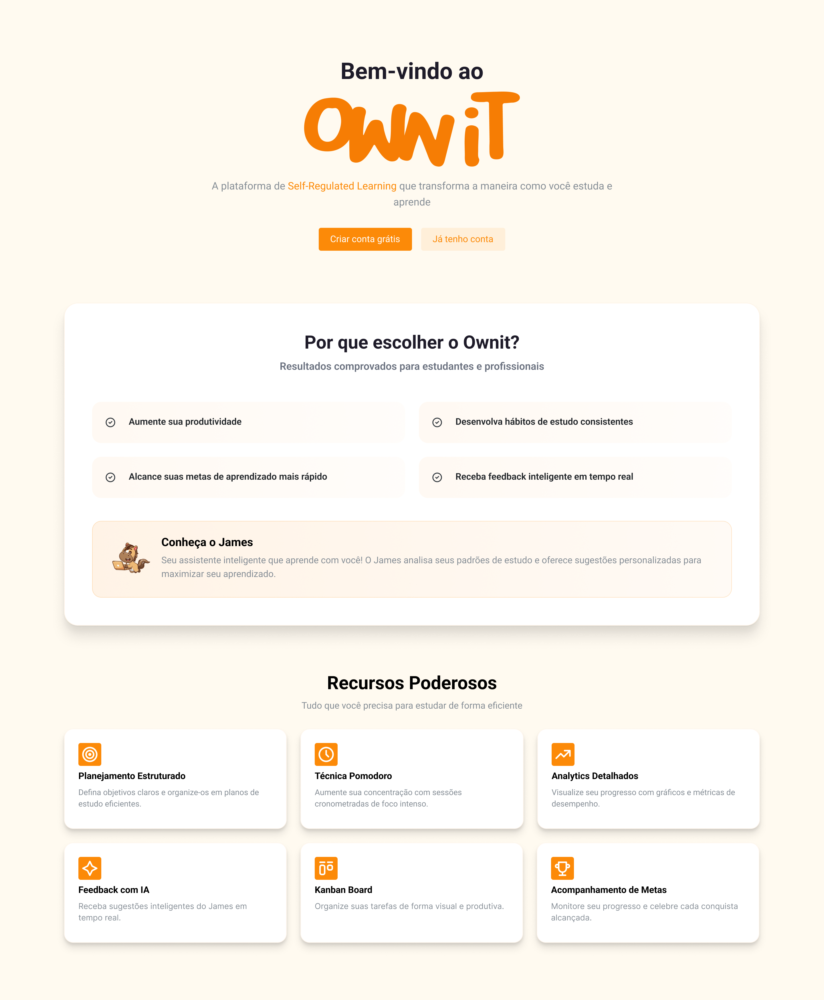
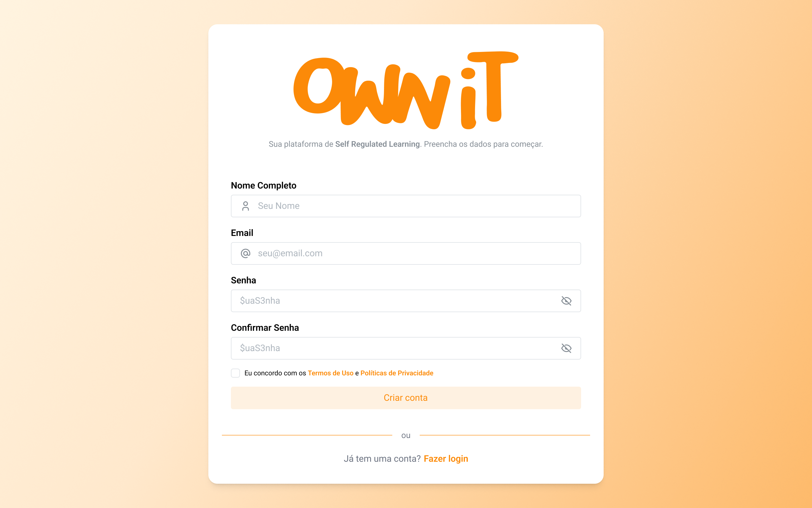
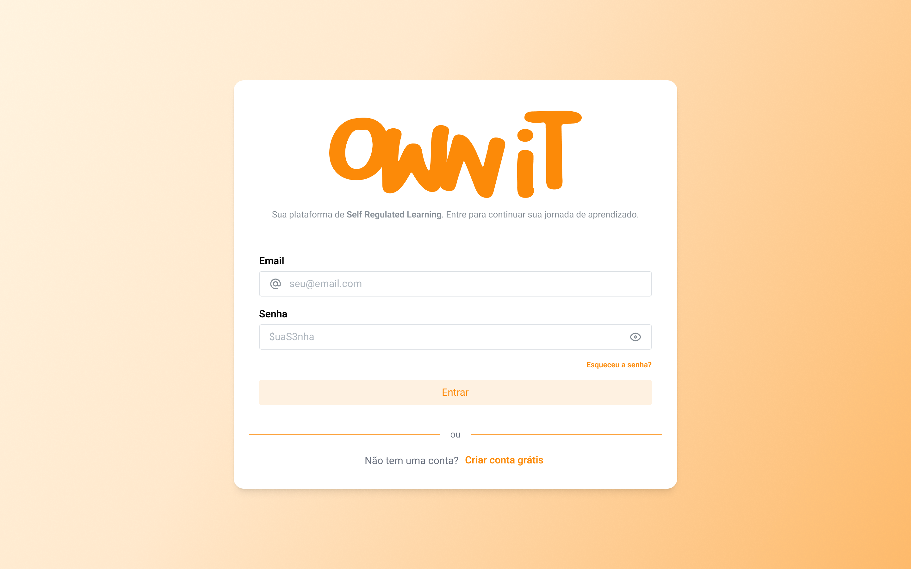

# Como Começar

Este guia irá ajudá-lo a dar os primeiros passos na plataforma Ownit, desde a
criação da sua conta até a configuração do seu primeiro plano de estudos.

## 1. Conheça a Plataforma

Ao acessar o Ownit pela primeira vez, você será recebido pela página de
boas-vindas com uma visão geral da plataforma e seus recursos.

A partir dessa página, você pode clicar em **"Criar conta grátis"** para se
registrar ou em **"Já tenho conta"** para fazer login.

Para mais detalhes sobre a página inicial, consulte
[Autenticação](./features/authentication.md).

---

## 2. Crie sua Conta

Clique em **"Criar conta grátis"** para acessar o formulário de registro.

Preencha seu **Nome Completo**, **Email**, **Senha** e **Confirme a Senha**.
Aceite os **Termos de Uso** e clique em **"Criar conta"**.

> Para detalhes sobre os campos e dicas de segurança, consulte
> [Autenticação → Criando uma Conta](./features/authentication.md#criando-uma-conta).

---

## 3. Faça Login

Se já possui uma conta, insira seu **Email** e **Senha** e clique em
**"Entrar"**.

> Esqueceu a senha? Use o link **"Esqueceu a senha?"** para recuperá-la.
> Mais detalhes em
> [Autenticação → Fazendo Login](./features/authentication.md#fazendo-login).

---

## 4. Crie seu Primeiro Plano de Estudos

Após fazer login, acesse a página **Planos** e clique em **"+ Novo Plano"**.

Preencha o **Título**, **Descrição**, **Tags** (opcional) e **Período** do
plano, depois clique em **"Salvar"**.

> Para detalhes sobre criação, filtragem e gerenciamento de planos, consulte
> [Planos de Estudo](./features/study-plan.md).

---

## 5. Adicione e Execute Sessões de Estudo

Dentro de um plano, clique em **"+ Adicionar"** para criar sessões de estudo
com título, descrição, data, duração e configuração do Pomodoro.

Ao iniciar uma sessão, você terá acesso a **Anotações**, **Timer Pomodoro**,
**Checklist** e **Histórico de Eventos**.

Ao concluir, clique em **"Finalizar Sessão"** e preencha o feedback avaliando
planejamento, domínio, dificuldade e estratégias utilizadas.

> Para o guia completo de sessões, consulte
> [Sessões de Estudo](./features/study-session.md).
> Para detalhes sobre o feedback, consulte
> [Feedbacks](./features/feedbacks.md).

---

## 6. Acompanhe seu Desempenho

Acesse **Estatísticas** na barra de navegação para ver métricas consolidadas
e gráficos de progresso.

O painel exibe Horas Dedicadas, Planos Ativos, Sessões Planejadas, Dia e
Horário mais Produtivo, além de gráficos de Tempo de Estudo Semanal e Sessões
Concluídas.

> Para detalhes sobre métricas e como interpretá-las, consulte
> [Desempenho](./features/analytics.md).

---

## Próximos Passos

Agora que você já conhece os primeiros passos, explore as funcionalidades em
detalhes:

- [Funcionalidades](./features/index.md) — Visão geral e ciclo de aprendizado
- [Autenticação](./features/authentication.md) — Registro, login e segurança
- [Planos de Estudo](./features/study-plan.md) — Criação, filtragem e detalhes
- [Sessões de Estudo](./features/study-session.md) — Execução, Pomodoro e
  anotações
- [Feedbacks](./features/feedbacks.md) — Auto-reflexão e melhoria contínua
- [Desempenho](./features/analytics.md) — Estatísticas e gráficos
- [Assistente de IA](./features/ai-assistant.md) — James, seu assistente
  inteligente
